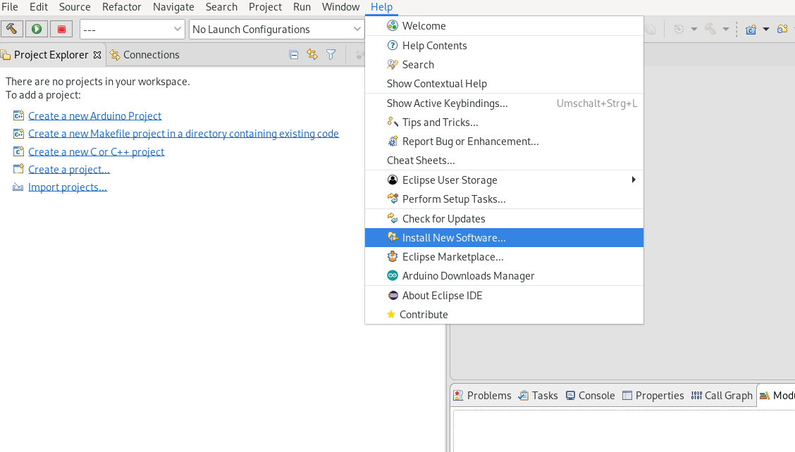

# HOW-TO setup Eclipse 2019.12 with latest ARM GNU Plugins openOCD and xPacks

This guide will show you how you can setup eclipse 2019.12 with latest version of openOCD and help you to import an makefile project and start debugging (at least an STM32F4). It is not quite straight forward so I thought I write it down for myself and maybe it will be useful for others.
The screenshots are mixed up alittle between Linux and Windows, because I haven't take all necessary screenshots at first time but shows also that this guide is os independant.

Almost all information is availalble at 
<https://gnu-mcu-eclipse.github.io/>
but it is somehow confusing to understand what you have to do if you have never done it before.
Here i will try to show you how I got everything working

### The Source
First open your browser and search in google for "gnu arm eclipse". In my search the first hit was the already the right one.


Hit the link and navigate to the download section

In the download section you can find the most links I have provided below. But there is much more info on this site so it is worth to read the stuff there (QEMU seems to be very promicing). Also when something should be unclear from this guide you can try to figure out how it was meant in the original. 


--- 
## Lets get started
Below I extracted all the steps with links which were necessary to install Eclipse with ARM tools in my Win10 partition

* ### Download Eclipse
    If you don't have eclipse on your PC, download it. You can rather download the basic c++ version from <https://www.eclipse.org/downloads/packages/> 
    
    and install the plug-ins by yourself by adding the updatesite (later!)
    
    
    or
    download the version with already installed plug-ins from
    <https://github.com/gnu-mcu-eclipse/org.eclipse.epp.packages/releases/>

## Setting up

   *Note: To install the xPacks you will need XPM. XPM needs Node.js to be installed on your computer. If you got working XPM already then just skip this steps and continue with ["Install the ARM-Environment"](#arm_env)*

* ### Install Node.js
    Go ahead and visit this link https://nodejs.org/en/ . Download the exe and install it. It asked me if I would like to install addictional build tools os something like that and to be sure everything would work I did it
    After that, if you type 
    ```
    node --version
    ```
    you should see something like this
    

    Now with 
    ```
    npm install --global xpm
    ```
    you can install xpm.
    
* ### <a name="arm_env"></a>Install the ARM-Environment

    *for linux: it is not necessary to run the commands as root or sudo, the xPacks will land in your home directory in linux under "/home/XXX/opt/xPacks" and in "C:\Users\XXX\AppData\Roaming\xPacks" on Windows*

  * ### (Windows ONLY!) GNU MCU Eclipse Windows Build Tools
    ```
    xpm install --global @gnu-mcu-eclipse/windows-build-tools@latest
    ```

  * ### xPack GNU Arm Embedded GCC
    ```
    xpm install --global @xpack-dev-tools/arm-none-eabi-gcc@latest
    ```
  * ### xPack OpenOCD
    ```
    xpm install --global @xpack-dev-tools/openocd@latest
    ```
    It did everything in one commandline window and it looked like this


Now you can check if everything is working.


## Start eclipse.

If you see something like this


then you probably downloaded 64 Bit Version of eclipse but only have Java 32 Bit installed on your PC. 

If your Eclipse starts then you can skip this step

  * ### Installing Java_x64

    Visit https://www.java.com/en/download/manual.jsp download and run installer. After that Eclipse should start

## Setup eclipse
   If you donwloaded the preconfigured version of eclipse there is no need to install the pluginy anymore. With basic 
   version you have to add the updatesite to eclipse repositories and install the plugins
   
   To add a new repository go to
   ```
   Help -> Install New Software
   ```
   

   Then add the Repository by pressing the "Add..." button and adding
   ```
   http://gnu-mcu-eclipse.netlify.com/v4-neon-updates
   ```
   

   
   
   Select the ARM Cross Compiler, Packs and OpenOCD Debugging and go through the install wizzard.

   

   If you installed the version with included plug-ins then all the available plugins will be grayed out
  
     You dont need to do anything at this stage.


At this stage it is already possible to import a Makefile project but it wont compile. because you can't select a MCU you as a target because the list is empty.
To change this you should perform the following steps:

* ### Install ARM MCU Packages

   Click on Modules Button


   Sync with online database


   You will see something like this  


   This will take a while, you can make a break and drink coffee.
 I've got also some errors that some modules are not available. Just click on "Ignore all" and hope that it wasn't the module you needed for your development :)

   If you get errors at the beginning like i did on linux, try to add another repository in 
   ```
   Window->Preferences->C/C++->Packages->Repositories
   ```
   Here is the link that worked for me
   ```
     http://sadevicepacksprodus.blob.core.windows.net/idxfile/index.pidx
   ```
   After the sync you should see the following picture
   

   Select the MCU's you want to develop with and klick on install, in my case i just installed all available STM32 MCU's
   

## Import the project

Get a copy of your desired project. In my case it is the bldc from the VESC project ( <https://github.com/vedderb/bldc> )

Now go ahead an select
```
New->Makefile Project with Existing Code
```


Navigate to the folder of your project, select "ARM Cross GCC" and click finish


Now, right click on the project and select properties.
```
C/C++ Build -> Settings -> Devices 
```
 select the MCU the project was built for


After you hit OK try to build the project with right click and "Build Project" and it should already work.
If it doesnt check if all the paths to the toolchain are set in Eclipse.
Select
```
window -> preferences -> MCU
```
And set the Global ARM Toolchain Path and Workspace ARM Toolchain Path by pressing the xPacks button and select the available option


## Now the debugging

Click on the down-arrow of the "Bug" button and select "Debug Configurations"


Select "GDB OpenOCD Debugging" and create New Configuration


The most stuff is already filled in by eclipse, but eclipse doesn't know to connect to your board


Thats why you need a .cfg file where it is configured. In my case the project provides already a file
called "stm32-bv-openocd.cfg" which is located in the root folder of the project. We tell OpenOCD what configuration to use with the "-f" option.
Dont get nervous if you dont have such a file. They are pretty generic i think and OpenOCD provides alof of them. you can find then in the OpenOCD folder which you installed with xPacks
in my case on linux the option was
```
-f /home/max/opt/xPacks/@xpack-dev-tools/openocd/0.10.0-13.1/.content/scripts/board/stm32f4discovery.cfg
```
or just 
```
-f board/stm32f4discovery.cfg
```

*Note: On linux it happened to me that wrong GDB was used, so I had to install "gdb-multiarch" and add*
```
set architecture arm
set mem inaccessible-by-default off
```
to commands in GDB Client setup.
I think this was due to I have made some experiments and variants before so my installation got somehow corrupted

thats all...

Please open an Issue if you have better solutions ot if i missed out some steps